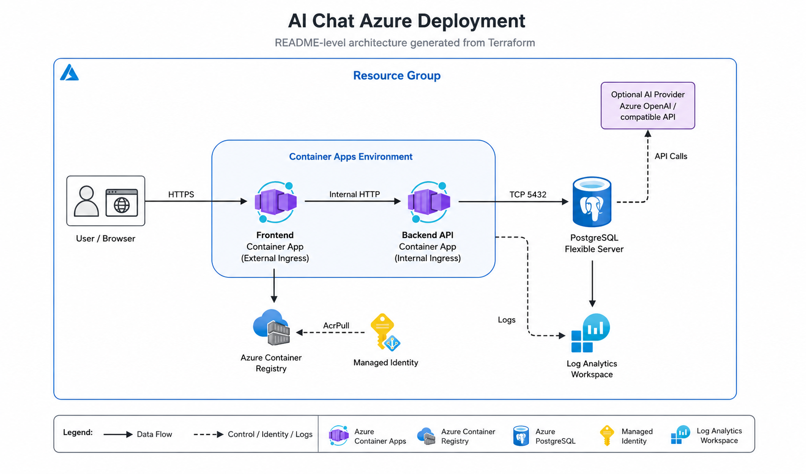
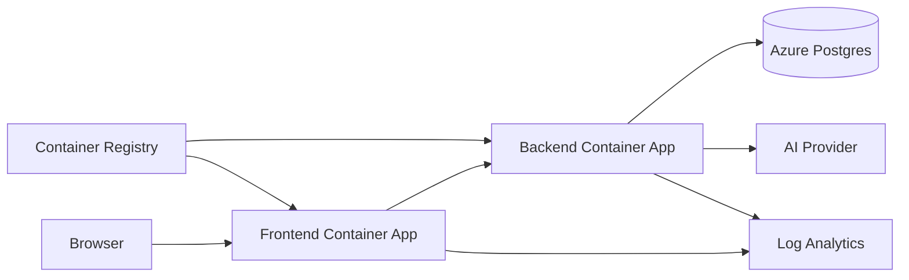

# Azure AI Chat

[](LICENSE)
[](https://nodejs.org/)
[](https://www.terraform.io/)
[](https://azure.microsoft.com/)

A production-shaped, cheap-by-default deployment of a ChatGPT-style application on Azure. One public frontend Container App, one private backend Container App, Azure Database for PostgreSQL Flexible Server for chat and training data, Azure Container Registry for images, and Azure Monitor Log Analytics for logs. Infrastructure is Terraform; CI/CD is GitHub Actions over OIDC.

## Azure Diagram

[](Architecture_Diagram.png)

> **Fork it, change the system prompt and branding, deploy to Azure.** The default AI provider is `mock` so the app works end-to-end with no API keys. AI coding assistants should start at [`AGENTS.md`](AGENTS.md).

Click **Use this template** above to start your fork. _(Repo owner: enable the template-repo toggle under Settings → General to make that button appear.)_

## Quickstart — run locally in 60 seconds

```bash
cp backend/.env.example backend/.env
cp frontend/.env.example frontend/.env
```

Edit `frontend/.env` and set **Supabase** values (see [Supabase authentication](#supabase-authentication) below and the step-by-step guide [`docs/supabase-setup.md`](docs/supabase-setup.md)). Without `VITE_SUPABASE_URL` and `VITE_SUPABASE_ANON_KEY`, the React app fails on startup and the browser shows a blank screen.

```bash
docker compose up --build
```

Open <http://localhost:8080>. Put AI settings in **`backend/.env`** (created from the `cp` above): e.g. `OPENAI_API_KEY` and `AI_PROVIDER=openai_compatible` (or leave provider as `mock` and only set the key — the backend will still pick OpenAI when the key is present). **`docker-compose.yml` loads that file into the backend container** and overrides `PG_*` so the app talks to the Compose Postgres service, not `localhost`.

| URL | What it serves |
| --- | --- |
| <http://localhost:8080> | Frontend (React UI) |
| <http://localhost:8080/api/config> | Backend through the Nginx proxy |
| <http://localhost:3000/healthz> | Backend health (direct) |

## Supabase authentication

Chat history is scoped to the signed-in account. The frontend sends the Supabase session JWT to the backend, the backend maps that subject to `app_users`, and each `chats` row is stored with the matching `user_id`. When a different account signs in, `/api/chats` only returns that account's conversations.

Full setup (project creation, dashboard toggles, SQL for `profiles`, local email confirmation): **[`docs/supabase-setup.md`](docs/supabase-setup.md)**.

The frontend uses **[`@supabase/supabase-js`](https://github.com/supabase/supabase-js)** only for **sign-in / sign-out and session handling** (email + password). Chats, messages, and streaming still go through the **Python backend** and your **Postgres** (`docker-compose` or Azure), not through Supabase’s database tables for chat.

**Why this dependency:** Supabase Auth gives you hosted user accounts, password hashing, email confirmation flows, and JWT access tokens without building that stack yourself. The SPA attaches the session JWT to `Authorization: Bearer …` when calling `/api/*` (see `frontend/src/api/client.ts`).

**What the anon key is:** The **anon** (public) key is meant to live in browser code. It is not a secret admin credential. It identifies your Supabase project to the Auth API; row-level security on any Supabase tables you add still applies to direct PostgREST calls. Do **not** put the **service_role** key in the frontend.

**Getting URL and keys:** In the [Supabase dashboard](https://supabase.com/dashboard) → your project → **Project Settings** → **API**: copy **Project URL** and the **anon public** key into `frontend/.env`. For local dev, you can turn off “Confirm email” under **Authentication** → **Providers** / **Sign In / Providers** so you can test sign-up without inbox clicks.

### Frontend environment variables (`frontend/.env`)

These are documented in `frontend/.env.example`. Typical local file:

| Variable | Required | Description |
| --- | --- | --- |
| `VITE_BACKEND_URL` | Yes (local dev) | Base URL of the FastAPI backend for the Vite dev proxy (e.g. `http://localhost:3000`). In Docker / Azure the public frontend container uses `BACKEND_BASE_URL` in Nginx instead. |
| `VITE_SUPABASE_URL` | Yes | Supabase project URL, e.g. `https://<project-ref>.supabase.co`. |
| `VITE_SUPABASE_ANON_KEY` | Yes | Supabase **anon public** API key from Project Settings → API. |

Restart `npm run dev` (or rebuild the frontend container) after changing any `VITE_*` variable; Vite reads them at build/start time only.

## Quickstart — deploy to Azure

Three steps; the first one is a ~30-minute one-time bootstrap per subscription:

1. **[First-time setup](#first-time-setup)** — bootstrap Terraform remote state and GitHub OIDC federation.
2. **[Deploy from GitHub Actions](#deploy-from-github-actions)** — push to `main` (or run the **Deploy** workflow manually). The workflow provisions the Azure resources, builds images, and rolls them out.
3. **[Customize for your scenario](docs/customization.md)** — change the system prompt, branding, and AI provider for your use case.

This template uses plain Terraform + GitHub Actions instead of the Azure Developer CLI (`azd`); see [`docs/upstream-templates.md`](docs/upstream-templates.md#why-we-dont-depend-on-azd) for the rationale and [`docs/follow-ups.md`](docs/follow-ups.md#7-optional-add-azure-developer-cli-azd-support) for the optional azd integration path.

## Customize for your scenario

The single source of truth for customization is [`docs/customization.md`](docs/customization.md). The most common edits, in the order most forks make them:

| What | Where | Effort |
| --- | --- | --- |
| System prompt | `AI_SYSTEM_PROMPT` env var (Terraform `ai_system_prompt`) | One line |
| AI provider + credentials | `AI_PROVIDER` + matching endpoint / API key | A few env vars |
| App name | `APP_NAME` env var (flows to `/api/config` and the UI header) | One line |
| Branding colors | `frontend/src/styles/app.css` (CSS variables, gradients, `.dark`) | Theme tokens |
| Starter prompts | `frontend/src/components/ChatPanel.tsx` (`QUICK_STARTS`, greeting prompts) | Edit arrays |
| Schema additions | `backend/app/db/schema.sql` + bump `SCHEMA_VERSION` in `backend/app/db/migrations.py` | New table + queries |
| Authentication | Local: Supabase email/password — [`docs/supabase-setup.md`](docs/supabase-setup.md), `frontend/.env`, `frontend/src/integrations/supabase/`. Production: Easy Auth / Entra in `backend/app/main.py` when `AUTH_ENABLED=true` | Env + optional middleware |

For per-file customization with line numbers and an AI-tool-friendly project map, see [`AGENTS.md`](AGENTS.md).

## Documentation

| Doc | Purpose |
| --- | --- |
| [`docs/architecture.md`](docs/architecture.md) | Component diagram, request flow, data flow, logging flow |
| [`docs/customization.md`](docs/customization.md) | Branding, system prompt, provider, schema, authentication, scenario examples |
| [`docs/supabase-setup.md`](docs/supabase-setup.md) | Supabase project, env vars, auth settings, optional `profiles` schema |
| [`docs/operations.md`](docs/operations.md) | Rollback, migrations, backup/restore, log queries, cost controls |
| [`docs/security.md`](docs/security.md) | Threat model + production hardening checklist |
| [`docs/troubleshooting.md`](docs/troubleshooting.md) | Symptom / cause / fix for common issues |
| [`docs/upstream-templates.md`](docs/upstream-templates.md) | Related Microsoft samples; why this template doesn't depend on `azd` |
| [`docs/follow-ups.md`](docs/follow-ups.md) | Prioritized improvements (managed identity, `pgvector`, real migration runner, query builder, ACR-side builds, OIDC scoping, optional `azd` integration) |
| [`infra/README.md`](infra/README.md) | Terraform module overview |
| [`AGENTS.md`](AGENTS.md) | Project map for AI coding assistants |

## Architecture



Why a frontend proxy? The backend has internal ingress only to reduce public attack surface. Browsers cannot reach internal Container Apps directly, so the public frontend container terminates HTTPS and proxies `/api/*` to the backend by Container Apps service-discovery name (e.g. `http://aca-aichat-backend-dev`).

## What gets deployed

By default, `terraform apply` creates:

- 1 Resource Group
- 1 Log Analytics Workspace (PerGB2018, 30 day retention)
- 1 Azure Container Registry (Basic, admin disabled)
- 1 User-assigned managed identity with `AcrPull`
- 1 Container Apps Environment (Consumption)
- 2 Container Apps: `frontend` (external) and `backend` (internal)
- 1 Azure Postgres Flexible Server (Burstable B1ms) + 1 database
- A few firewall rules so Azure-origin traffic can reach Postgres during development

Optional resources behind variables (off by default):

- Azure OpenAI account + deployment
- Custom log ingestion (Data Collection Rule + custom table)
- Key Vault
- Private networking (VNet + private endpoints)
- Custom domain + managed certificate

## Cheapest default configuration and cold-start tradeoffs

> **The default settings are optimized for low idle cost, not low latency.** The frontend Container App scales to zero (Nginx cold-starts in ~2 s, the SPA shows a loader, usually fine). The backend stays at one replica because its cold start (Python + Postgres + optional migrations) is long enough to 504 the first `/api/*` request through the Container Apps edge. Postgres Flexible Server on Burstable B1ms also stays running, so there's no DB cold-start. To make the frontend always-warm too, set `frontend_min_replicas = 1`. To bring back full scale-to-zero (and accept the 504 risk), set `backend_min_replicas = 0`.

| Component | Default | Why |
| --- | --- | --- |
| Container Apps plan | Consumption | Only plan that scales to zero |
| `frontend_min_replicas` | 0 | Nginx cold start is fast; saves ~$15/mo |
| `backend_min_replicas` | 1 | Avoids 504s on the first request after idle |
| `frontend_max_replicas` / `backend_max_replicas` | 1 | Caps cost during a traffic spike; raise for real use |
| Frontend / Backend CPU | 0.25 vCPU | Smallest practical |
| Frontend / Backend memory | 0.5 Gi | Smallest practical |
| Postgres SKU | `B_Standard_B1ms` | Cheapest always-on Flexible Server tier |
| Postgres storage | 32 GB | Minimum supported |
| Postgres backup retention | 7 days | Minimum |
| Postgres geo-redundant backup | off | Cheapest |
| ACR SKU | Basic | Cheapest |
| Log Analytics retention | 30 days | Default free tier in most subs |
| AI provider | `mock` | No model cost; smoke tests pass without Azure OpenAI |

## Prerequisites

- Azure subscription with the right to create resource groups, Container Apps, Postgres Flexible Server, ACR, and role assignments.
- GitHub repository with permission to add secrets and variables.
- Local tools: `az` CLI ≥ 2.55, `terraform` ≥ 1.8, `docker`, Python ≥ 3.12 (backend), `node` ≥ 20 (frontend), `gh` CLI (recommended — the bootstrap scripts can push GitHub secrets/variables for you with `--set-secrets` / `--set-vars`).

## First-time setup

### 1. Azure login

```bash
az login
# If not prompted to select a subscription, set it explicitly:
az account set --subscription <SUBSCRIPTION_ID> 
```

### 1b. GitHub CLI login (optional but recommended)

The bootstrap scripts can write GitHub environment secrets and variables for you with `--set-secrets` / `--set-vars`, so you don't have to add them by hand in the GitHub UI. To enable that path, log in once:

```bash
gh auth login   # GitHub.com -> HTTPS -> Login with a web browser
```

The default scopes (`repo`, `read:org`, `workflow`, `gist`) are sufficient — no extra scopes needed. The scripts also auto-create the target environment (e.g. `dev`) if it does not exist yet.

Without `gh auth login` (or without `gh` installed), the scripts still do all the Azure work; they just print the values for you to paste into **Settings → Environments → dev** manually.

### 2. Bootstrap Terraform remote state

The state file holds provider API keys and the Postgres admin password, so it must live in Azure Storage with restricted access.

```bash
./scripts/bootstrap-tf-state.sh \
  --subscription-id <SUBSCRIPTION_ID> \
  --location westeurope \
  --resource-group rg-tfstate-aichat \
  --storage-account sttfstateaichat$RANDOM \
  --container tfstate \
  --set-vars                       # optional: pushes the 5 vars below to the dev environment via gh
```

Without `--set-vars` the script prints the values for manual entry into **Settings → Environments → dev**.

### 3. Bootstrap Microsoft Entra application + GitHub OIDC

```bash
./scripts/bootstrap-azure-oidc.sh \
  --subscription-id <SUBSCRIPTION_ID> \
  --github-owner <YOUR_GH_OWNER> \
  --github-repo <YOUR_REPO> \
  --app-name gh-aichat-dev \
  --environment dev \
  --scope subscription \
  --set-secrets                    # optional: pushes AZURE_CLIENT_ID/TENANT_ID/SUBSCRIPTION_ID to the dev environment via gh
```

The script creates the app, service principal, role assignment, and federated credential. It prints `AZURE_CLIENT_ID`, `AZURE_TENANT_ID`, `AZURE_SUBSCRIPTION_ID`. With `--set-secrets` they are written straight into the `dev` environment; without it, copy them in manually.

### 4. Choose a Postgres admin password

The Terraform module does **not** generate a Postgres admin password — you control it. Pick a strong password (12+ chars; Azure Postgres Flexible Server enforces complexity — mix of upper/lower/digit/symbol):

```bash
# Generate one if you like:
openssl rand -base64 36 | tr -d '/+=' | cut -c1-32
```

Save it in two places:

- **GitHub environment secret** named `TF_VAR_sql_admin_password` (under Settings → Environments → dev → Add secret). The deploy workflow passes this as a Terraform variable. Set it again under the `prod` environment if you use one.
- **Local shell** when running Terraform manually:

  ```bash
  export TF_VAR_sql_admin_password='your-strong-password-here'
  ```

  Or pass `-var="sql_admin_password=..."` to `terraform apply` (single-quote it so your shell doesn't expand `$`).

> If you ever need to rotate it, update the GitHub secret, then redeploy. Terraform will reset the Postgres admin password on the next apply.

### 5. Choose a resource-name suffix

Several Azure resources need globally unique names (ACR, Postgres server, storage account). Pick a short, lowercase, alphanumeric suffix once and pin it:

```bash
# 6 random hex chars are enough for most cases.
openssl rand -hex 3
```

Save it as either:

- `TF_VAR_resource_name_suffix` (GitHub environment variable, **not** a secret), or
- `-var="resource_name_suffix=abc123"` on the local CLI.

### 6. GitHub repository secrets and variables

Set these in **Settings → Environments → dev** (and a `prod` environment if you use it):

Secrets:

- `AZURE_CLIENT_ID`
- `AZURE_TENANT_ID`
- `AZURE_SUBSCRIPTION_ID`
- `TF_VAR_sql_admin_password`
- `TF_VAR_azure_openai_api_key` *(optional)*
- `TF_VAR_openai_api_key` *(optional)*

Variables:

- `AZURE_LOCATION` (e.g. `westeurope`)
- `TF_STATE_RESOURCE_GROUP`
- `TF_STATE_STORAGE_ACCOUNT`
- `TF_STATE_CONTAINER` (`tfstate`)
- `TF_STATE_KEY` (`ai-chat/dev.tfstate`)
- `TF_VAR_resource_name_suffix`
- `TF_VAR_project_name` *(optional, default `aichat`)*
- `TF_VAR_environment_name` *(optional, default `dev`)*

## Deploy from GitHub Actions

Push to `main`, or run the **Deploy** workflow from the Actions tab. `deploy.yml` is an orchestrator that calls three reusable workflows in order:

1. **Deploy Infra** (`deploy-infra.yml`) — `terraform apply` to create / update RG, ACR, SQL, Log Analytics, Container Apps environment, and the two Container Apps. On the first run, Container Apps start with a public hello-world image (bootstrap). After that, `image` and `target_port` are owned by the per-service pipelines (Terraform's `ignore_changes` prevents reverts).
2. **Deploy Backend** (`deploy-backend.yml`) — build and push `backend:<sha>`, then `az containerapp update --image` + `az containerapp ingress update --target-port 3000`. Backend goes first so the frontend can hit a fresh API.
3. **Deploy Frontend** (`deploy-frontend.yml`) — same flow on port 8080.
4. **Smoke test** — `/healthz`, `/api/config`, chat creation, and SSE streaming through the frontend's public URL.

Each child workflow can also be triggered independently from the Actions tab (`Run workflow` button). To auto-deploy a single layer when its folder changes — for example, deploy only the backend on `backend/**` changes — uncomment the `push:` trigger block at the top of the child workflow (it's there but commented out). The orchestrator's `push: main` trigger stays as the default full-stack deploy.

## Deploy manually from your local machine

The local flow mirrors the GitHub Actions workflow. Three stages, ~10–15 min total. You'll need `terraform`, `az`, `docker`, and `git` on `PATH`, plus `az login` already done.

### Stage 1 — First apply (bootstrap images)

Brings up the full Azure stack — resource group, ACR, Postgres, Log Analytics, Container Apps environment, and the two Container Apps — with public hello-world containers in place of the real app images. ACR is created here but is still empty.

```bash
cd infra
# infra/backend.hcl was written by scripts/bootstrap-tf-state.sh (gitignored).
# If you haven't run that, pass -backend-config="key=value" flags directly.
terraform init -backend-config=backend.hcl
export TF_VAR_sql_admin_password='your-strong-password-here'
export TF_VAR_resource_name_suffix='abc123'
terraform apply -var="use_bootstrap_images=true"
```

When this finishes:

```bash
terraform output -raw frontend_url
```

returns the public HTTPS URL. Opening it shows the Microsoft hello-world page — that's expected; the real frontend hasn't been built yet.

### Stage 2 — Build and push the real images

```bash
cd ..
./scripts/build-and-push.sh
```

The script reads `acr_name` and `acr_login_server` from terraform output and builds + pushes `frontend:<git-sha>` and `backend:<git-sha>` (plus `:latest`) for both apps.

If a local Docker daemon is available it builds and pushes locally. If Docker isn't installed (or you don't have permission on `/var/run/docker.sock`), the script auto-falls back to `az acr build`, which uploads the build context to ACR and builds remotely there — no Docker daemon needed. Force a mode with `BUILD_MODE=local` or `BUILD_MODE=remote`.

### Stage 3 — Swap to real images + verify

The container apps' `image` and `ingress.target_port` are owned by `az containerapp update` (Terraform has `ignore_changes` set on them — see `infra/modules/container-apps/main.tf`). Don't `terraform apply` here; use the Azure CLI:

```bash
TAG=$(git rev-parse HEAD)
RG=$(terraform -chdir=infra output -raw resource_group_name)
ACR_LS=$(terraform -chdir=infra output -raw acr_login_server)
BACKEND=$(terraform -chdir=infra output -raw backend_container_app_name)
FRONTEND=$(terraform -chdir=infra output -raw frontend_container_app_name)

az containerapp update --name "$BACKEND"  --resource-group "$RG" --image "$ACR_LS/backend:$TAG"
az containerapp ingress update --name "$BACKEND"  --resource-group "$RG" --target-port 3000

az containerapp update --name "$FRONTEND" --resource-group "$RG" --image "$ACR_LS/frontend:$TAG"
az containerapp ingress update --name "$FRONTEND" --resource-group "$RG" --target-port 8080
```

Each `az containerapp update` creates a new revision. The previous revision drains in ~30s. Then smoke-test it:

```bash
./scripts/smoke-test.sh --url "$(terraform -chdir=infra output -raw frontend_url)"
```

The script hits `/healthz`, `/api/config`, creates a chat, and confirms an SSE `done` event.

> Why bootstrap images? The Container Apps need a valid image reference at create time, but ACR is empty on the very first apply. The bootstrap step uses a public hello-world image so the rest of the stack comes up cleanly; the per-service pipelines (or the `az` commands above) swap to the real images once they've been pushed.

## Local development

See the [Quickstart at the top](#quickstart--run-locally-in-60-seconds) for the three-command local setup. For contributor guidelines (lint, tests, commit messages), see [`CONTRIBUTING.md`](CONTRIBUTING.md).

## Configuring AI providers

Set `AI_PROVIDER` (and the matching credentials) in the backend container's environment. Terraform variables map straight into Container App env vars.

### Azure OpenAI (existing resource)

```hcl
ai_provider              = "azure_openai"
ai_model                 = "gpt-4.1-mini"
azure_openai_endpoint    = "https://YOUR-RESOURCE.openai.azure.com/"
azure_openai_deployment  = "gpt-4.1-mini"
azure_openai_api_version = "2024-10-21"
# Pass azure_openai_api_key via TF_VAR_azure_openai_api_key (GitHub environment secret).
```

For local Docker development, put the same values in `backend/.env`:

```env
AI_PROVIDER=azure_openai
AI_MODEL=gpt-4.1-mini
AZURE_OPENAI_ENDPOINT=https://YOUR-RESOURCE.openai.azure.com/
AZURE_OPENAI_DEPLOYMENT=YOUR-DEPLOYMENT-NAME
AZURE_OPENAI_API_VERSION=2024-10-21
AI_WEB_SEARCH_ENABLED=true
```

### Azure OpenAI (provision via this stack)

```hcl
ai_provider         = "azure_openai"
enable_azure_openai = true
ai_model            = "gpt-4.1-mini"
```

### OpenAI / OpenAI-compatible

```hcl
ai_provider     = "openai_compatible"
ai_model        = "gpt-4o-mini"
openai_base_url = "https://api.openai.com/v1"
openai_model    = "gpt-4o-mini"
# Pass openai_api_key via TF_VAR_openai_api_key.
```

For local Docker development, the backend also supports `AI_WEB_SEARCH_ENABLED=true` in `backend/.env`. With the OpenAI / Azure OpenAI Responses API, this lets the assistant search the web for current travel, transport, and destination information before answering when the selected provider supports the tool.

### Mock (default)

No configuration required. Streams a deterministic answer for smoke tests.

## Customizing Terraform SKUs and scale

### Less cold-start pain

Backend already defaults to one always-on replica. Pin the frontend too if you want zero cold start on the SPA itself:

```hcl
frontend_min_replicas = 1
frontend_max_replicas = 3
backend_max_replicas  = 3
```

### Bigger backend

```hcl
backend_cpu          = 0.5
backend_memory       = "1Gi"
backend_max_replicas = 5
```

### Bigger Postgres

```hcl
postgres_sku_name   = "GP_Standard_D2s_v3"  # 2 vCPU general-purpose
postgres_storage_mb = 65536                  # 64 GB
```

See `infra/variables.tf` for every knob.

## Database schema and training data export

Tables: `app_users`, `chats`, `messages`, `message_feedback`, `training_datasets`, `training_examples`, `app_events`, `schema_migrations`.

Export training examples as JSONL:

```bash
# locally
./scripts/export-training-jsonl.sh --base-url http://localhost:8080 > examples.jsonl

# against deployed app
./scripts/export-training-jsonl.sh --base-url "$(terraform -chdir=infra output -raw frontend_url)" > examples.jsonl
```

> **Storing training examples in Postgres does not fine-tune a model.** It gives you a clean, queryable store. To actually fine-tune, export to JSONL and feed it into Azure OpenAI fine-tuning, an Azure ML pipeline, or your evaluation framework.

## Logs and monitoring

Container Apps console + system logs flow into Log Analytics automatically.

```kusto
ContainerAppConsoleLogs_CL
| where ContainerAppName_s contains "backend"
| order by TimeGenerated desc
| take 100
```

```kusto
ContainerAppSystemLogs_CL
| where ContainerAppName_s contains "backend"
| where Log_s has_any ("Error", "ErrImagePull", "ContainerCrashing")
| order by TimeGenerated desc
```

```kusto
ContainerAppConsoleLogs_CL
| where Log_s has "chat.completion.completed"
| extend parsed = parse_json(Log_s)
| summarize count(), avg(toint(parsed.latencyMs)) by bin(TimeGenerated, 15m)
```

## Security notes and production hardening checklist

The defaults are dev-friendly. Before exposing the app to real users, work through this list:

- [ ] Move provider secrets to managed identity or Key Vault (`enable_key_vault = true`).
- [ ] Set `allow_azure_services_to_sql = false` and use private endpoints or explicit IP rules for Postgres.
- [ ] Add authentication — Container Apps auth or Microsoft Entra ID — in the FastAPI app (`backend/app/main.py` middleware) when enabling `AUTH_ENABLED`.
- [ ] Add rate limiting / abuse protection.
- [ ] Set `frontend_min_replicas = 1` if the SPA cold start is unacceptable (backend already defaults to 1).
- [ ] Adjust Log Analytics retention to your compliance requirements.
- [ ] Add a custom domain and managed certificate.
- [ ] Enable private networking (`enable_private_networking = true`) for ACR and Postgres.
- [ ] Restrict the GitHub OIDC federated credential to a protected environment/branch.
- [ ] Enable image and dependency vulnerability scanning (Defender for Cloud, Dependabot is already on).
- [ ] Restrict access to the Terraform state container — it contains the Postgres admin password and any provider keys.

See `docs/security.md` for a deeper walkthrough.

## Troubleshooting

See `docs/troubleshooting.md` for the full list. Quick hits:

- **Cold-start timeout on first request** — expected with `min_replicas = 0`. Retry, or raise the floor to 1.
- **Frontend returns 502 on `/api/*`** — check the backend Container App is `Running` and that `BACKEND_BASE_URL` resolves the backend's app name (it should be `http://aca-aichat-backend-<env>`).
- **`ErrImagePull` on first deploy** — confirm the Terraform apply used `use_bootstrap_images=true` (the default) and that the per-service deploy pushed the `<sha>` tag to ACR before running `az containerapp update`.
- **SSE streaming chunks arrive in one batch** — verify Nginx has `proxy_buffering off` and your client/CDN don't buffer.

## Destroy / cleanup

```bash
gh workflow run destroy.yml -f environment=dev -f confirm=destroy
# or locally:
cd infra && terraform destroy
```

> Destroy permanently deletes the Postgres database, all chats, and all training examples. There is no recovery.

## Useful Azure docs

- [Azure Container Apps plans](https://learn.microsoft.com/en-us/azure/container-apps/plans)
- [Azure Container Apps cold start](https://learn.microsoft.com/en-us/azure/container-apps/cold-start)
- [Service-to-service communication](https://learn.microsoft.com/en-us/azure/container-apps/connect-apps)
- [Container Apps logging with Log Analytics](https://learn.microsoft.com/en-us/azure/container-apps/log-monitoring)
- [Managed identity image pulls](https://learn.microsoft.com/en-us/azure/container-apps/managed-identity-image-pull)
- [Azure Database for PostgreSQL Flexible Server overview](https://learn.microsoft.com/en-us/azure/postgresql/flexible-server/overview)
- [Postgres Flexible Server compute and storage options](https://learn.microsoft.com/en-us/azure/postgresql/flexible-server/concepts-compute-storage)
- [Azure Container Registry SKUs](https://learn.microsoft.com/en-us/azure/container-registry/container-registry-skus)
- [GitHub Actions OIDC in Azure](https://docs.github.com/en/actions/how-tos/secure-your-work/security-harden-deployments/oidc-in-azure)
- [Azure Login with OIDC](https://learn.microsoft.com/en-us/azure/developer/github/connect-from-azure-openid-connect)
- [Terraform AzureRM provider](https://registry.terraform.io/providers/hashicorp/azurerm/latest/docs)

## License

MIT — see `LICENSE`.
