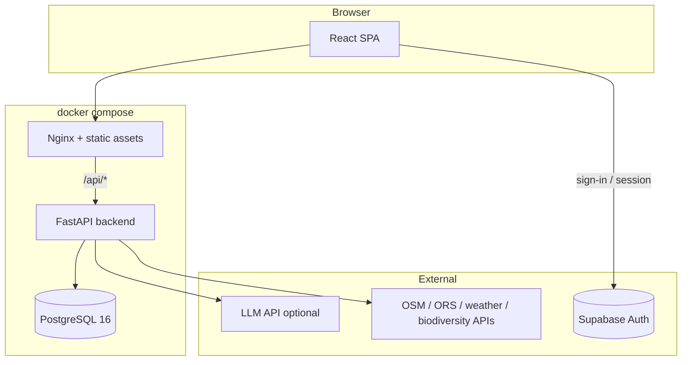

# Local Host

[](LICENSE)
[](https://nodejs.org/)
[](https://www.python.org/)
[](https://docs.docker.com/compose/)

**Local Host** is a React + FastAPI app for exploring Greek trails with an AI companion: interactive maps (OpenStreetMap and live trail data), weather and biodiversity context, and streaming chat backed by PostgreSQL. Sign-in uses **Supabase Auth** (email/password); chats and messages are stored in **your** Postgres via the Python API, not Supabase’s database.

For tooling and file-level guidance, see [`AGENTS.md`](AGENTS.md).

## Screenshots

<p align="center">
  
</p>

<p align="center">
  
</p>

<p align="center">
  
</p>

<p align="center">
  
</p>

## Architecture

### Overview

| Piece | Role |
| --- | --- |
| **Frontend** | Vite + React 19 + Tailwind; Leaflet map; calls `/api/*` on the same origin in Docker (Nginx reverse proxy). |
| **Nginx** (in `frontend` image) | Serves the built SPA and proxies `/api/*` to the backend with buffering disabled so SSE chat streams flush immediately. |
| **Backend** | FastAPI (Python 3.12): auth middleware (Supabase JWT), chats/messages/feedback/training, streaming completions, **trails** routes that aggregate OSM, routing, weather, and iNaturalist-style data. |
| **PostgreSQL** | Persists `app_users`, `chats`, `messages`, feedback, training tables, and `app_events`. Schema in `backend/app/db/schema.sql`; migrations on startup when enabled. |
| **Supabase** | Used only for **authentication** in the browser (sign-in, session, refresh). The SPA sends `Authorization: Bearer <access_token>` to the API; the backend reads the JWT payload to obtain `sub` / email (see `backend/app/auth.py`). |
| **AI provider** | Pluggable: **mock** (no keys) or **OpenAI-compatible** HTTP APIs. Configuration lives in `backend/.env` (see `backend/.env.example`). |

### Diagram (local / Docker Compose)



### Request flow

1. The user opens the app (e.g. `http://localhost:8080`). Nginx serves the SPA; React Router handles `/`, `/login`, and `/chat/:threadId`.
2. After Supabase sign-in, the client attaches the session access token to API calls.
3. **`/api/chats`**, **`/api/messages`**, and chat completion endpoints run in FastAPI: user is resolved/created in `app_users`, data is read/written in Postgres.
4. **Streaming replies** use Server-Sent Events through the same Nginx path (`proxy_buffering off` in the frontend image config).
5. **`/api/trails`** (and related endpoints) fetch live trail networks, telemetry, routing, and enrichment from external services; responses are shaped for the map UI.

## Quickstart

```bash
cp backend/.env.example backend/.env
cp frontend/.env.example frontend/.env
```

Configure **Supabase** in `frontend/.env` (`VITE_SUPABASE_URL`, `VITE_SUPABASE_ANON_KEY`). Without them, the app will not start correctly in the browser. Step-by-step: [`docs/supabase-setup.md`](docs/supabase-setup.md).

```bash
docker compose up --build
```

| URL | Purpose |
| --- | --- |
| [http://localhost:8080](http://localhost:8080) | Full stack: SPA + `/api/*` via Nginx |
| [http://localhost:3000/healthz](http://localhost:3000/healthz) | Backend health (direct) |

`docker-compose.yml` injects Postgres connection settings into the backend container. Put AI keys and `AI_PROVIDER` in **`backend/.env`** (see `backend/.env.example`). Default provider is **mock** so the stack runs without paid APIs.

## Frontend environment (`frontend/.env`)

| Variable | Required | Description |
| --- | --- | --- |
| `VITE_BACKEND_URL` | Yes (local `npm run dev`) | Base URL of the API for the Vite dev proxy (e.g. `http://localhost:3000`). |
| `VITE_SUPABASE_URL` | Yes | Supabase project URL. |
| `VITE_SUPABASE_ANON_KEY` | Yes | Supabase **anon** public key (safe for the browser; not the service role key). |

Restart the dev server after changing `VITE_*` variables.

## Supabase authentication

Chat history is scoped to the signed-in user: the backend maps the JWT subject to `app_users` and filters `chats` by `user_id`.

Details, dashboard settings, and optional `profiles` SQL: **[`docs/supabase-setup.md`](docs/supabase-setup.md)**.

## AI providers

Set `AI_PROVIDER` and related variables in `backend/.env` (see `backend/.env.example`).

- **mock** — Deterministic streaming responses; good for CI and layout work.
- **openai_compatible** — Any OpenAI-style HTTP API (`OPENAI_API_KEY`, optional `OPENAI_BASE_URL`, `OPENAI_MODEL`).

Optional: `AI_WEB_SEARCH_ENABLED=true` when the configured provider supports web search tools.

## Documentation

| Doc | Purpose |
| --- | --- |
| [`docs/customization.md`](docs/customization.md) | Branding, prompts, providers, schema, auth notes |
| [`docs/supabase-setup.md`](docs/supabase-setup.md) | Supabase project and env setup |
| [`docs/troubleshooting.md`](docs/troubleshooting.md) | Common failures and fixes |
| [`docs/security.md`](docs/security.md) | Threat model and hardening checklist |
| [`CONTRIBUTING.md`](CONTRIBUTING.md) | Lint, tests, contribution expectations |
| [`AGENTS.md`](AGENTS.md) | Project map for AI-assisted development |

## Local development (without Docker)

From `backend/`: install dependencies, copy `.env`, run migrations as configured, start uvicorn on port 3000.  
From `frontend/`: `npm install`, set `.env`, `npm run dev` (uses `VITE_BACKEND_URL` for the proxy).

## Database and training export

Schema: `backend/app/db/schema.sql` — bump `SCHEMA_VERSION` in `backend/app/db/migrations.py` when you add DDL.

Export training examples as JSONL (requires a running API and auth as appropriate for your environment):

```bash
./scripts/export-training-jsonl.sh --base-url http://localhost:8080 > examples.jsonl
```

## Prerequisites

- **Docker** + Docker Compose (recommended path above), or Node 20+, Python 3.12+, and Postgres 16 for a fully local toolchain.

## License

MIT — see [`LICENSE`](LICENSE).
