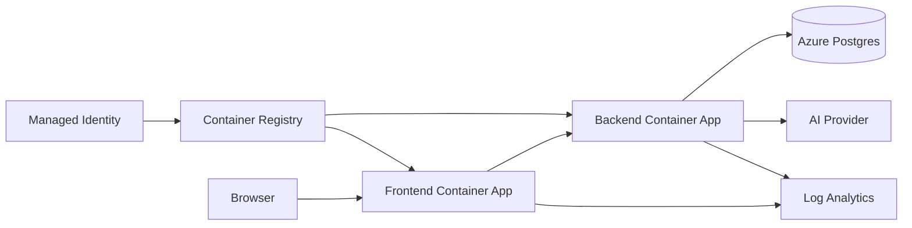

# Architecture

## Components

- Frontend: React + Nginx, external ingress.
- Backend: Python + FastAPI, internal ingress.
- Postgres: Azure Database for PostgreSQL Flexible Server (Burstable B1ms by default).
- AI: mock, Azure OpenAI, or any OpenAI-compatible endpoint.
- Logs: Container console + system logs flow into Log Analytics.
- ACR: image source for both Container Apps; admin disabled, pulls via managed identity.

## Request flow

1. The browser hits `https://<frontend-fqdn>` and loads the React app.
2. JavaScript in the browser issues `fetch("/api/...")` requests against its own origin.
3. Nginx in the frontend container terminates the request, then proxies it to `http://<backend-app-name>` over the Container Apps service-discovery network.
4. The backend authenticates (placeholder), validates the body, talks to Postgres, and streams a response from the configured AI provider.
5. For chat completions the backend writes Server-Sent Events (`message.created`, `token`, `message.completed`, `done`) which Nginx forwards unbuffered (`proxy_buffering off`) to the browser.

## Deployment flow

The deploy pipeline is split into three reusable workflows under `.github/workflows/`, orchestrated by `deploy.yml`:

1. **Deploy Infra** — Terraform creates ACR, the Container Apps Environment, both Container Apps with `mcr.microsoft.com/azuredocs/containerapps-helloworld` images, the Postgres Flexible Server + database, and the Log Analytics workspace. The hello-world images come up cleanly because they need no external dependencies; this gets the Container Apps into a healthy state before ACR has any images.
2. **Deploy Backend** — Builds `backend:<sha>`, pushes to ACR, then runs `az containerapp update --image=...` and `az containerapp ingress update --target-port 3000`. A new revision rolls out; the previous one drains.
3. **Deploy Frontend** — Same flow on port 8080.

Image and target port are owned by the per-service pipelines, not Terraform. The Container Apps resources have `lifecycle { ignore_changes = [template[0].container[0].image, ingress[0].target_port] }`, so subsequent infra applies (env vars, scaling knobs, etc.) don't revert the live image. The bootstrap-image config only takes effect when the Container Apps are first created.

## Frontend proxy

The frontend's job is to be a public, HTTPS-terminated entry point that can stream SSE. It does not run any application logic of its own — Nginx serves the static React bundle and proxies every `/api/*` request to the backend by Container Apps service-discovery name (`http://aca-aichat-backend-<env>`).

Why a proxy and not direct calls?

- The backend is internal-ingress-only, so the browser can't reach it.
- We want the browser to talk to a single origin so we don't need CORS or a public backend.
- SSE needs `proxy_buffering off`, otherwise tokens arrive in batches.

## Data flow

- **Chats**: `chats` per chat thread, `messages` with `role`, `content`, `provider`, `model`, `latency_ms`, `metadata_json`. Messages link to chats by `chat_id`.
- **Feedback**: `message_feedback` records ±1 rating + optional comment per message.
- **Training data**: `training_examples` stores `input_text` / `expected_output_text` pairs, optionally grouped into `training_datasets`. Examples may reference the original chat/messages via FK columns.
- **App events**: `app_events` is a structured event sink. The backend writes to it via the telemetry service; Log Analytics is the primary place to query operational logs.

## Logging flow

- Container console logs (stdout/stderr) flow into Log Analytics tables `ContainerAppConsoleLogs_CL` and `ContainerAppSystemLogs_CL` automatically — no DCR required.
- The backend logs structured JSON with Pino. Each request gets a `requestId` from the `x-request-id` header (or a fresh UUID). The id is included in every log line and in error response bodies.
- Optional: with `enable_custom_log_ingestion = true` Terraform creates a Data Collection Endpoint, Data Collection Rule, and `AiAppEvents_CL` custom table. Wiring the backend to push to that DCE is documented in `operations.md` but is not enabled by default.

## See also

- [`customization.md`](customization.md) — change the system prompt, branding, AI provider, schema, or auth.
- [`operations.md`](operations.md) — rollback, migrations, log queries, custom log ingestion.
- [`troubleshooting.md`](troubleshooting.md) — symptom / cause / fix for the most common deploy and runtime issues.
